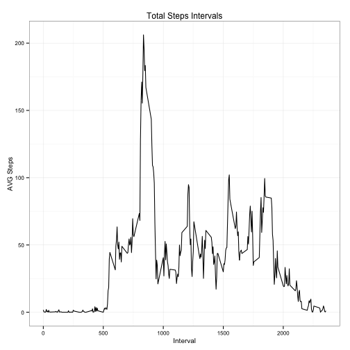

---
output:
  md_document:
    variant: markdown_github
---
# Reproducible Research: Peer Assessment 1  


## Loading and preprocessing the data

```r
data<-read.csv("activity.csv",header = TRUE)
dataWithNa<-data
data<-na.exclude(data)
library(data.table)
```

```
## data.table 1.9.2  For help type: help("data.table")
```

```r
dt <- data.table(data)
dt<-dt[,list(mean=mean(steps),median = median(steps), sum=sum(steps)),by=date]
```

Some summary about the given data.

```r
summary(dataWithNa)
```

```
##      steps               date          interval   
##  Min.   :  0.0   2012-10-01:  288   Min.   :   0  
##  1st Qu.:  0.0   2012-10-02:  288   1st Qu.: 589  
##  Median :  0.0   2012-10-03:  288   Median :1178  
##  Mean   : 37.4   2012-10-04:  288   Mean   :1178  
##  3rd Qu.: 12.0   2012-10-05:  288   3rd Qu.:1766  
##  Max.   :806.0   2012-10-06:  288   Max.   :2355  
##  NA's   :2304    (Other)   :15840
```


## Total Steps

```r
library(ggplot2)
c <- ggplot(dt, aes(x=date,y=dt$sum))
c + geom_bar(stat = "identity",width=0.7,color="blue")+ labs(x="Date",y="Steps",title="Total Steps per Day")+ theme_bw(base_size=10)+ theme(axis.text.x=element_blank()) 
```

 

## What is mean total number of steps taken per day?
Median:  

```r
median(dt$median)
```

```
## [1] 0
```

Mean:  

```r
mean(dt$mean)
```

```
## [1] 37.38
```

## What is the average daily activity pattern?
1.  

```r
#Some Calculations to gather data by interval
dI <- data.table(data)
dI<-dI[,list(mean=mean(steps),median = median(steps), sum=sum(steps)),by=interval]
#Plotting
c <- ggplot(dI, aes(x=interval,y=dI$mean))
c + geom_line() + labs(x="Interval",y="AVG Steps",title="Total Steps Intervals") + theme_bw(base_size=10)
```

 
  
2.  

```r
maxSteps <- max(dI$mean)
maxStepsInterval<-dI[dI$mean==maxSteps,]$interval
```
The interval with the max average is 835 with an average of 206.1698 steps.

## Imputing missing values
Number of NA:  

```r
sum(is.na(dataWithNa$steps))
```

```
## [1] 2304
```


Imputing the mean of steps in a new data frame of the NA entries in the data set.

```r
# Fill the NA value with the mean of steps in a new data frame
dataSet<-data.frame(dataWithNa)
dataSet$steps[is.na(dataSet$steps)]<-mean(dt$mean)
```


```r
c<-ggplot(dataSet, aes(x=date,y=dataSet$steps))
c+geom_bar(stat = "identity",width=0.7,color="blue")+labs(x="Date",y="Steps",title="Total Steps per Day")+theme_bw(base_size=10) + theme(axis.text.x=element_blank())
```

 
  
Mean:  

```r
mean(dataSet$steps)
```

```
## [1] 37.38
```
  
Median:

```r
median(dataSet$steps)
```

```
## [1] 0
```
There is very little observable difference.

## Are there differences in activity patterns between weekdays and weekends?

```r
weekd<-factor(c("weekday","weekend"))
dataSet$date<-as.Date(dataSet$date)
dataSet$date<-weekdays(dataSet$date)
## Subset 2 independent dataSets
weekdays<-subset(dataSet, dataSet$date %in% c("Monday", "Tuesday", "Wednesday", "Thursday", "Friday"))
weekends<-subset(dataSet, dataSet$date %in% c("Saturday", "Sunday"))
weekdays$date<-"WeekDay"
weekends$date<-"WeekEnd"
dataSet<-rbind(weekdays,weekends)
dI <- data.table(dataSet)
dI<-dI[,list(mean=mean(steps),median = median(steps), sum=sum(steps),date=date),by=list(interval,date)]
c <- ggplot(dI, aes(x=interval, y=dI$mean, group=date))
c + geom_line() + labs(x="Interval",y="AVG Steps",title="Total Steps Intervals") + theme_bw(base_size=10) + facet_grid(date ~ .)
```

 


